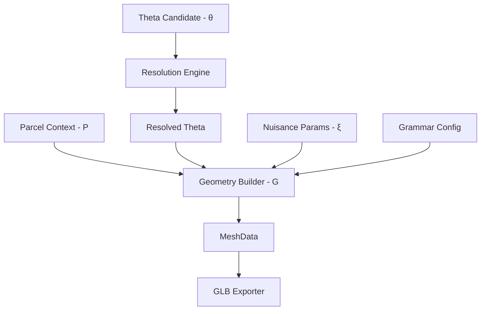

# Step 18: Theta Interface

Este documento formaliza la separación paramétrica de la generación procedural, transformando la gramática (V4) en un sistema explícitamente controlable: `G(P, θ, ξ) -> MeshData`.

## Conceptos Fundamentales

### P (ParcelContext)
El contexto inmutable de la parcela. Define el terreno sobre el cual se construirá el edificio.
- **Qué incluye:** Polígono de la parcela, lados explícitos de frente (contacto con calle), identificador único.
- **Por qué está separado:** El edificio (θ) debe poder existir conceptualmente y luego "implantarse" o adaptarse a diferentes contextos P.

### θ (Architectural Identity - Theta)
Los parámetros macro-arquitectónicos que definen la "identidad" del edificio. Si vemos el edificio mañana en una foto real, estos son los rasgos que esperaríamos reconocer y que la IA debe intentar inferir.
- **Qué incluye:** Huella principal (masas), ejes de vanos, perfiles de fachada, balcones, retrocesos (setbacks), materiales principales, estilos de techo y cercos.
- **Por qué está separado:** Es el "Target Representation" a optimizar. Debe ser explícito, interpretable, auditable, y determinista. Un cambio en θ cambia la arquitectura de forma predecible.

### ξ (Nuisance Parameters - Xi)
La variación micro-estocástica que le da naturalidad y detalle procedural al modelo, pero que no altera su identidad. "Basura" o "ruido" que no vale la pena inferir desde imágenes.
- **Qué incluye:** Semillas para la distribución fina de plantas, pequeñas variaciones de color/desgaste en los muros, ángulos de cortinas, rotaciones de tanques de agua, micro-jitter en varillas (rebars).
- **Por qué está separado:** Permite re-renderizar el mismo edificio (mismo θ) con ligeras variaciones (diferente ξ), o mantener los detalles visuales estables si se ajusta una ventana (mismo ξ, diferente θ).

### Config (GrammarConfig)
Parámetros técnicos o constantes del motor geométrico que no pertenecen a la identidad del edificio ni son variables estocásticas.
- **Qué incluye:** Versión de la gramática, umbrales de LOD (DetailBudget), tolerancias de triangulación, snap a grilla, definiciones exactas del catálogo de materiales PBR.
- **Por qué está separado:** Garantiza reproducibilidad técnica y evita contaminar el vector de estado θ con detalles de implementación computacional.

### Evidence & Resolved Theta
- **Evidence:** Valores explícitos o inciertos (unknown) inferidos. `null` representa desconocimiento (ausencia de evidencia), mientras que listas vacías `[]` representan ausencia confirmada de un elemento.
- **Resolved Theta:** El estado final completamente expandido donde los valores `unknown` han sido completados mediante *priors* arquitectónicos deterministas. El proceso de *completion* transforma el Theta parcial/candidato en un Theta resuelto, listo para ser consumido por el motor geométrico.

## Diagrama de Flujo (Flowchart)



## Resumen del Schema (theta-candidate-v0, schema 0.1)

El schema de θ (versión `0.1`) está estructurado para soportar entradas híbridas y resolverlas jerárquicamente:

- `massing`: Puede ser explícito (lista de masas con footprints poligonales y alturas) o implícito (altura global, pisos).
- `facade`: Patrón principal de la fachada (ventanas, galerías, muros ciegos). Soporta *overrides* específicos por arista o masa geométrica, e incluso posiciones explícitas para vanos irregulares.
- `roof`: Tipo, parapeto y listado opcional de objetos de azotea.
- `site`: Cerco, jardín y tramos explícitos de perímetro.
- `materials`: Asignación de clases de materiales por región semántica.

La implementación vive en `src/domain/theta.py`; usa `dataclasses` tipadas,
decodificación estricta, `canonical()` y JSON. `None` significa desconocido o
valor que se completará; una tupla vacía significa ausencia explícita.

## Uso

Desde `investigation/procedural_reconstruction`:

```sh
python steps/step18_theta_interface/run.py \
  --theta steps/step18_theta_interface/examples/01_simple.json \
  --output steps/step18_theta_interface/outputs/manual_01
```

El comando produce `input_theta.json`, `resolved_theta.json`, `manifest.json`,
un GLB y dos vistas diagnósticas. `gallery.py` genera los cinco ejemplos y la
rejilla de intervenciones.

## Pre-Step19 hardening (theta-candidate-v0, schema 0.2)

La baseline anterior está en `PRE_STEP19_BASELINE.md`. El contrato sigue en
`domain/theta.py`; los cinco casos manuales de estrés están en
`challenge_cases/`. La versión 0.2 valida incertidumbre y permite ajustar
fachadas/cubiertas parciales sin transformar una excepción en una lista de todos
los vanos.

### Semántica de valores

| Tipo | Omitido o `null` | Valor explícito |
|---|---|---|
| Escalar | Desconocido, se completa con prior/version | Valor conocido/inferido |
| Booleano | Desconocido, se completa | `false` = ausencia conocida; `true` = presencia conocida |
| Entidades suplementarias | Desconocidas; se usa el patrón familiar cuando aplica | `[]` = ninguna; lista = entidades indicadas |

`facade.openings` tiene una excepción deliberada: en `mode=repeat`, `null` deja
que la regla genere los vanos; en `mode=explicit`, se exige una lista, y `[]`
declara una pared sin vanos. `facade.projections=null` y
`facade.material_regions=null` aceptan el relieve/regiones de la familia;
`[]` los suprime. `opening_edits` y `added_openings` son correcciones escasas
del modo repetitivo. En `site.runs`, `null` permite la generación del cerco
según `site.fence`; `[]` declara ningún tramo. `roof.props=null` se completa
con lista vacía; `[]` indica ausencia observada.

`ReconstructionRequest.theta` se conserva exactamente como se escribió.
`resolved_theta.json` registra la hipótesis completa y `completion_details`
da `value`, `source` y `policy` por campo completado. La evidencia permanece
como un mapa separado: ni `prior/completed` ni `derived` se convierten en
`observed`.

### Altura, pisos y masas

`P.locked_height_m` tiene prioridad y debe coincidir exactamente con la altura
de θ si esta fue especificada; un conflicto es error. Con altura desconocida
y pisos conocidos, el prior es `floors × 2.8 m`. Si ambos faltan, el prior
conservador es 8.4 m y 3 pisos. Con altura conocida y pisos desconocidos,
se infieren los pisos redondeando `height/2.8`, sujetos a un piso de 2.2–6 m.
La altura de piso/niveles resulta de `height/floors` y no es otro target.
Si `massing.pattern=explicit`, `masses[].levels_m` manda; `height_m` y `floors`
globales deben omitirse y se derivan de esas masas. Una altura externa
incompatible produce error.

### Cubiertas y masa canónica

`roof` es el valor global. `roofs[]` modifica `kind`, `parapet_m` y `slope_deg`
de la masa indicada; los polígonos de superficie se derivan de la exposición.
Un override inexistente, sin cubierta expuesta, o una pendiente inactiva es
error. `roof.props[]` mantiene objetos por referencia de masa.

Toda masa se nombra `role:index`; el índice se deriva, dentro de cada rol, del
centroide XY, cota base, área y geometría normalizada. Reordenar la lista del
JSON preserva las referencias. Un nombre de rol solo, como `main`, sigue
aceptándose en JSON antiguos únicamente cuando es inequívoco. Los frentes y
aristas usan anillos CCW canónicos comenzando en el vértice lexicográficamente
menor. Cambiar sustancialmente la geometría puede cambiar la referencia; en
Step 19 hay que revisar las anotaciones al cambiar masas.

### Patrón repetitivo con excepciones

`mode=repeat` admite `opening_edits` con selector estable `(floor,bay)` y
acción `suppress` o `replace`, además de `added_openings`. Se valida que el
selector exista y que el nuevo vano quepa sin solaparse. `mode=explicit`
conserva el control total: `openings` es la lista autoritativa y los edits
repetitivos son inválidos. El caso `01_regular_exception.json` usa tres edits
para once vanos resueltos.
Un `FacadeOverride` repetitivo hereda los controles globales de `facade` y
solo reemplaza los campos no nulos. Al indicar `bay_axes_m` reemplaza
`bay_count` y viceversa; `balconies=false` apaga la profundidad heredada.

### Paths de evidencia

El prefijo `theta.` es recomendado; el formato antiguo sin prefijo sigue
admitido. No se aceptan índices posicionales de listas como identidad.

```text
theta.height_m
theta.massing.upper_setback_m
theta.facades[main:0,edge:0].controls.opening_edits[floor:1,bay:2].action
theta.roofs[setback:0].kind
theta.masses[main:0].levels_m
```

`Evidence.state` es `observed`, `inferred`, `unknown` o `externally_known`;
`confidence` y `view_ids` son opcionales. `unknown` debe apuntar a un valor
`null` en la petición. La cámara/imagen vive en `observations`, no en θ.

### Migración 0.1 → 0.2

Los cinco ejemplos originales siguen funcionando. El lector acepta
`schema_version` 0.1 y 0.2; los ejemplos que omiten la versión usan 0.2.
Los nombres existentes permanecen. En 0.2, `facade.cladding`, `services`,
`projections`, `material_regions`, `stairs`, `roof.props`,
`side_material` y `finish` usan `null` al omitirse. Los valores explícitos
viejos mantienen su significado. Se añadieron `roofs[]`, `opening_edits` y
`added_openings`; `mass_role` y `RoofObject.mass_role` aceptan `role:index`.
`GrammarConfig.completion_policy` predeterminada es `conservative-0.2`.
Los JSON 0.1 se leen, pero una ejecución 0.2 no promete igualdad binaria
del GLB candidato antiguo: cambian IDs canónicos de componentes y streams de
microdetalle. El pathway histórico `grammar-v1.0` sí mantiene los tres golden
exactos. Conservar el JSON de entrada y la versión de política permite
auditar la migración.

Errores: contradicción de altura, geometría/solapamiento inválido, referencia
inexistente, override inactivo o vano fuera de pared. No se emiten warnings
automáticos todavía; una confianza baja o un prior de completion quedan
visibles en `evidence`/`completion_details` para revisión humana.

Los renders iso/street son diagnósticos de malla y material, no comparación
fotométrica con una imagen real. El ejercicio de ajuste visual real sigue en
Step 19; esta candidata aún no está congelada como theta-v1.

Este schema es altamente compactable, serializable en JSON y diseñado explícitamente para soportar "unknown" en cualquier campo.
