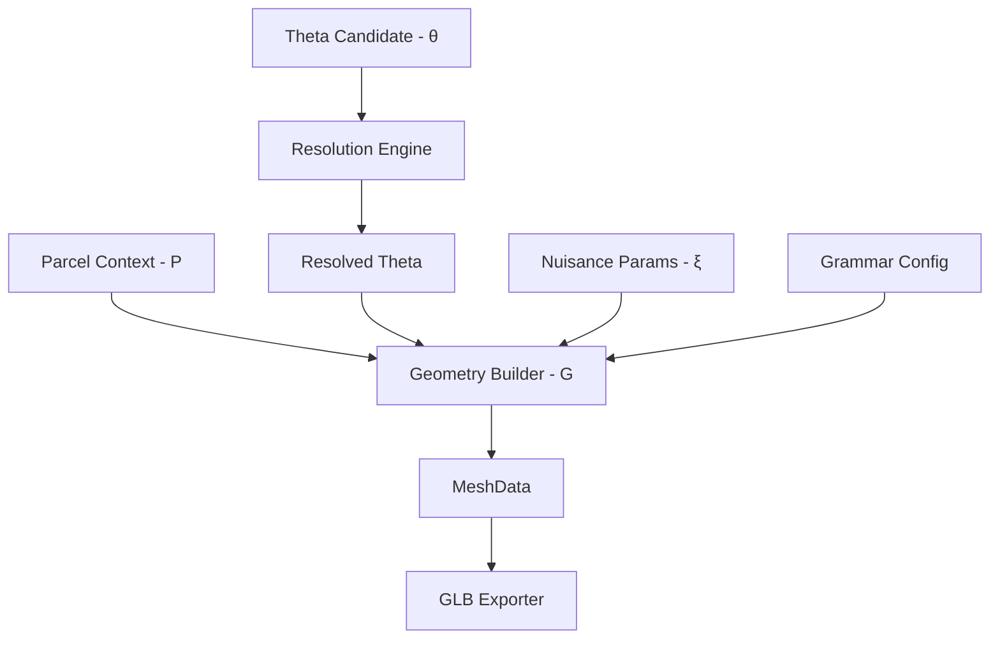

# Step 18: Theta Interface

Este documento formaliza la separación paramétrica de la generación procedural, transformando la gramática (V4) en un sistema explícitamente controlable: `G(P, θ, ξ) -> MeshData`.

## Conceptos Fundamentales

### P (ParcelContext)
El contexto inmutable de la parcela. Define el terreno sobre el cual se construirá el edificio.
- **Qué incluye:** Polígono de la parcela, lados explícitos de frente (contacto con calle), identificador único.
- **Por qué está separado:** El edificio (θ) debe poder existir conceptualmente y luego "implantarse" o adaptarse a diferentes contextos P.

### θ (Architectural Identity - Theta)
Los parámetros macro-arquitectónicos que definen la "identidad" del edificio. Si vemos el edificio mañana en una foto real, estos son los rasgos que esperaríamos reconocer y que la IA debe intentar inferir.
- **Qué incluye:** Huella principal (masas), ejes de vanos, perfiles de fachada, balcones, retrocesos (setbacks), materiales principales, estilos de techo y cercos.
- **Por qué está separado:** Es el "Target Representation" a optimizar. Debe ser explícito, interpretable, auditable, y determinista. Un cambio en θ cambia la arquitectura de forma predecible.

### ξ (Nuisance Parameters - Xi)
La variación micro-estocástica que le da naturalidad y detalle procedural al modelo, pero que no altera su identidad. "Basura" o "ruido" que no vale la pena inferir desde imágenes.
- **Qué incluye:** Semillas para la distribución fina de plantas, pequeñas variaciones de color/desgaste en los muros, ángulos de cortinas, rotaciones de tanques de agua, micro-jitter en varillas (rebars).
- **Por qué está separado:** Permite re-renderizar el mismo edificio (mismo θ) con ligeras variaciones (diferente ξ), o mantener los detalles visuales estables si se ajusta una ventana (mismo ξ, diferente θ).

### Config (GrammarConfig)
Parámetros técnicos o constantes del motor geométrico que no pertenecen a la identidad del edificio ni son variables estocásticas.
- **Qué incluye:** Versión de la gramática, umbrales de LOD (DetailBudget), tolerancias de triangulación, snap a grilla, definiciones exactas del catálogo de materiales PBR.
- **Por qué está separado:** Garantiza reproducibilidad técnica y evita contaminar el vector de estado θ con detalles de implementación computacional.

### Evidence & Resolved Theta
- **Evidence:** Valores explícitos o inciertos (unknown) inferidos. `null` representa desconocimiento (ausencia de evidencia), mientras que listas vacías `[]` representan ausencia confirmada de un elemento.
- **Resolved Theta:** El estado final completamente expandido donde los valores `unknown` han sido completados mediante *priors* arquitectónicos deterministas. El proceso de *completion* transforma el Theta parcial/candidato en un Theta resuelto, listo para ser consumido por el motor geométrico.

## Diagrama de Flujo (Flowchart)



## Resumen del Schema (theta-candidate-v0, schema 0.1)

El schema de θ (versión `0.1`) está estructurado para soportar entradas híbridas y resolverlas jerárquicamente:

- `massing`: Puede ser explícito (lista de masas con footprints poligonales y alturas) o implícito (altura global, pisos).
- `facade`: Patrón principal de la fachada (ventanas, galerías, muros ciegos). Soporta *overrides* específicos por arista o masa geométrica, e incluso posiciones explícitas para vanos irregulares.
- `roof`: Tipo, parapeto y listado opcional de objetos de azotea.
- `site`: Cerco, jardín y tramos explícitos de perímetro.
- `materials`: Asignación de clases de materiales por región semántica.

La implementación vive en `src/domain/theta.py`; usa `dataclasses` tipadas,
decodificación estricta, `canonical()` y JSON. `None` significa desconocido o
valor que se completará; una tupla vacía significa ausencia explícita.

## Uso

Desde `investigation/procedural_reconstruction`:

```sh
python steps/step18_theta_interface/run.py \
  --theta steps/step18_theta_interface/examples/01_simple.json \
  --output steps/step18_theta_interface/outputs/manual_01
```

El comando produce `input_theta.json`, `resolved_theta.json`, `manifest.json`,
un GLB y dos vistas diagnósticas. `gallery.py` genera los cinco ejemplos y la
rejilla de intervenciones.

Este schema es altamente compactable, serializable en JSON y diseñado explícitamente para soportar "unknown" en cualquier campo.
